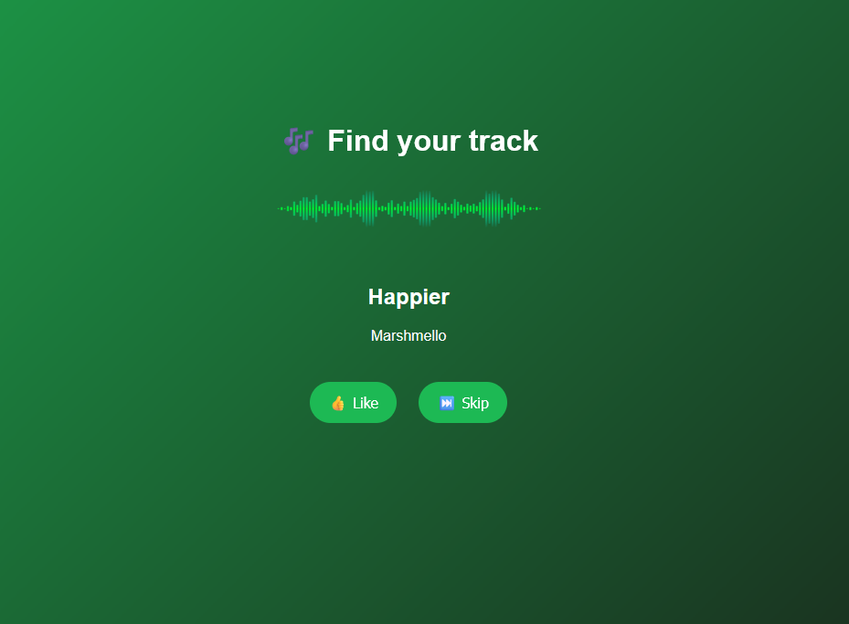

# 🎶 Music Recommendation System

A machine learning powered music recommender built with **FastAPI**, **XGBoost**, and **SQLite**.  
The system analyzes user preferences and suggests tracks based on similarity of audio features and personalized ML predictions.

---

## 🚀 Features
- User authentication by name
- Like/Skip feedback loop
- Personalized track recommendations using **cosine similarity** + **XGBoost classifier**
- Tracks database with parameters (danceability, energy, valence, etc.)
- Automatic update of user preference profile after each like
- Web interface with embedded Spotify player

---

## 🛠 Tech Stack
- **Backend**: Python, FastAPI, SQLite
- **ML/AI**: Pandas, NumPy, Scikit-learn, XGBoost
- **Frontend**: HTML, CSS, JavaScript (Spotify embed)
- **Other**: Joblib (model persistence)

---

## 📂 Project Structure
```
project/
│── main.py              # FastAPI app
│── db_funcs.py          # Database helpers
│── model.py             # XGBoost model creation
│── generate_data.py     # Synthetic training data
│── templates/           # HTML frontend
│── DB/                  # SQLite databases
│── data/                # Tracks dataset
```

---

## ⚡ How It Works
1. User enters their name → system loads/creates profile  
2. System recommends a track (based on cosine similarity + ML prediction)  
3. User **likes** or **skips** → feedback is stored in DB  
4. If liked → user profile averages are updated with new track parameters  
5. New track is recommended → loop continues 🎧 

---

## 📊 Example Workflow
1. Start the app:
   ```bash
   uvicorn main:app --reload
   ```
2. Open browser at:
   ```
   http://127.0.0.1:8000
   ```
3. Enter your name → get first track  
4. Like 👍 or Skip ⏭️  
5. System learns your taste and improves recommendations  

---

## 🖼 Demo / Screenshots

---

## 🤝 Why This Project
This project demonstrates:
- Full ML pipeline integration into a web service
- Real-time personalization using feedback
- Experience with Python, FastAPI, ML, and databases
